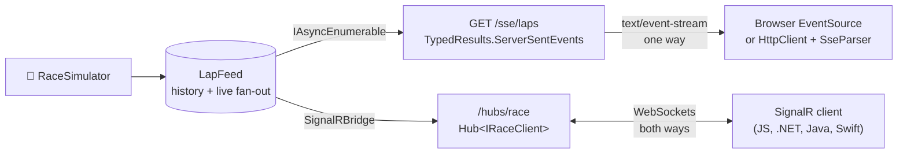

<div align="center">

# 📡 signalr-vs-sse-dotnet10

**One live race feed, served two ways from the same ASP.NET Core app: .NET 10's built-in Server-Sent Events and SignalR. Same laps, different trade-offs.**

[](https://github.com/atonyhonesto/signalr-vs-sse-dotnet10/actions/workflows/ci.yml)


Companion code for my LinkedIn articles<br>
**[SignalR vs .NET 10 Server-Sent Events: Real-Time Communication →](https://www.linkedin.com/pulse/signalr-vs-net-10-server-sent-events-real-time-tony-honesto-ofigc/)**<br>
**[Real-Time Applications with SignalR →](https://www.linkedin.com/pulse/real-time-applications-signair-tony-honesto-4celc/)**

</div>

---

## The setup



## Run it

```bash
git clone https://github.com/atonyhonesto/signalr-vs-sse-dotnet10.git
cd signalr-vs-sse-dotnet10
dotnet run --project src/RaceFeed.Demo        # starts the server, connects five clients, runs a race
dotnet test                                   # SSE ids, filtering, resume, SignalR groups, client calls
dotnet run --project src/RaceFeed.Server      # just the server: curl -N localhost:5000/sse/laps
```

Real output from CI:

```text
Race feed on http://127.0.0.1:33669: 4 cars x 5 laps

Transport  Client                Laps  Notes
SSE        all cars                20  text/event-stream, event ids 1..20
SSE        ?car=24                  5  filtered on the server: cars 24
SSE        dropped and resumed    6+14 reconnected with Last-Event-ID 6: no gaps, no duplicates
SignalR    group all               20  pushed over the negotiated transport (WebSockets by default)
SignalR    group car-24             5  cars 24
SignalR    RequestPit(24, 3)        -  server replied PitConfirmed(car 24, lap 4) on the same connection: SSE has no client-to-server channel
```

## How each side is built

**Server-Sent Events** (new in .NET 10: `TypedResults.ServerSentEvents`) is a minimal-API endpoint that returns an `IAsyncEnumerable<SseItem<T>>`. Each item carries an event type and an **event id**; a client that drops and reconnects sends `Last-Event-ID`, and the endpoint replays from the feed's history so nothing is lost:

```csharp
app.MapGet("/sse/laps", (LapFeed feed, HttpRequest request, string? car, CancellationToken ct) =>
{
    var after = long.TryParse(request.Headers["Last-Event-ID"], out var id) ? id : feed.CurrentSeq;
    return TypedResults.ServerSentEvents(Laps(feed.Subscribe(after, ct), car));
});
```

**SignalR** is a hub with a strongly typed client interface. Groups (`all`, `car-24`) decide who gets what, and the client can call the server on the same connection (`RequestPit` → `PitConfirmed`).

## Which one, when

| | Server-Sent Events | SignalR |
|---|---|---|
| Direction | Server → client only | Both directions |
| Protocol | Plain HTTP; works through proxies and CDNs that allow streaming | WebSockets, falling back to SSE or long polling |
| Client | Built into every browser (`EventSource`), `curl -N`, any HTTP client | SignalR client library per platform |
| Reconnect | Built into `EventSource`, resumes with `Last-Event-ID` (you replay) | Automatic reconnect available; missed messages are yours to handle |
| Fan-out | You manage subscribers | Groups, users, connections; Azure SignalR Service or a Redis backplane to scale out |
| Payload | UTF-8 text (JSON here) | JSON or MessagePack |
| Pick it for | Live scores, dashboards, notifications, LLM token streaming | Chat, collaboration, control panels, anything interactive |

## Project layout

```text
src/RaceFeed.Server/   LapFeed (history + fan-out), RaceSimulator, RaceHub, SignalRBridge, RaceApp (endpoints)
src/RaceFeed.Demo/     SseClient (SseParser), SignalRWatcher, RaceHarness, DemoProgram
tests/RaceFeed.Tests/  end-to-end tests against a real Kestrel server on a random port
```

---

<sub>Built by **Tony Honesto**, cloud & integration engineer with roots in IndyCar timing & scoring and NASCAR Race Control. More: [github.com/atonyhonesto](https://github.com/atonyhonesto) · [article-labs](https://github.com/atonyhonesto/article-labs) · [LinkedIn](https://www.linkedin.com/in/tony-honesto-4195023)</sub>
